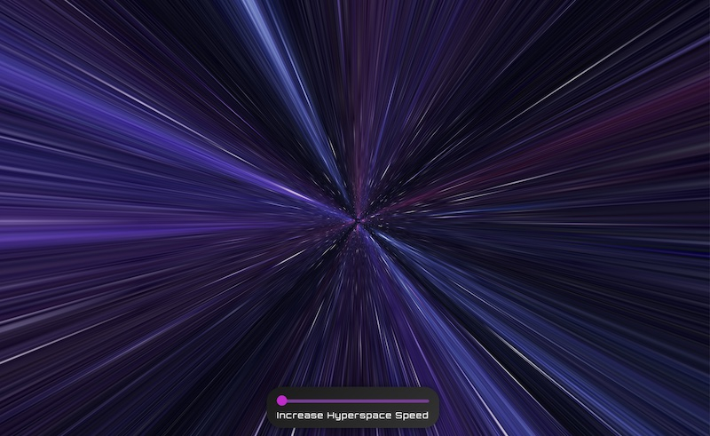

# 🚀 Nebula Cruise

Dive into the vastness of space with Nebula Cruise. An immersive hyperspace jump journey through the cosmos. Control the pace of your voyage and experience the beauty of interstellar space travel.

## ⚠️ Warning

If you have a history of epilepsy, light sensitivity, or motion sickness, please be cautious before viewing. The animation contains fast-moving visuals that might trigger seizures for people with these conditions. Always ensure you're viewing in a safe environment.

[Preview the project on Vercel](https://nebula-cruise.vercel.app)

## 🌌 Project Overview

_Nebula Cruise_ is an interactive animation that simulates the experience of a hyperspace jump through interstellar space. With a user-friendly speed control, you're in the captain's seat, navigating the beauty of the universe.

## 🚀 Features

- 🌌 Stunning 3D Hyperspace animation
- 🎛️ Interactive speed control dial

## 🔧 How to Use

1. 🕹️ Use the speed control dial at the bottom of the screen to adjust the hyperspace speed.
2. 🌌 Enjoy the journey!

## 📈 Future Enhancements

- 🎶 Background space music option for immersive experience
- 🌌 More galaxy backgrounds for additional animated voyages

## 🙌 Credits

- 🌌 Galaxy wall texture ("Blue and purple space galaxy") by **sololos**

## 📜 License

This project is open source and available under the [MIT License](LICENSE).

